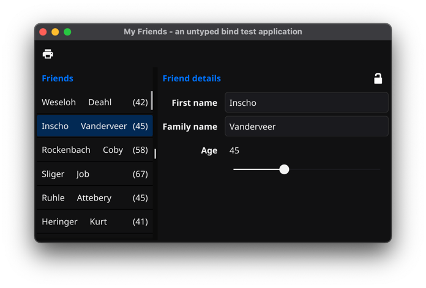

= MyFriends - Fyne bind external test application

This is an example application to test the "external bind" functionality of the Golang UI library Fyne.
If you would like to see examples of bound external data then I hope this example application can be of use.

== Architecture using Fyne bind external

This is MyFriends UI application with a list of selectable names to the left and an "edit details panel" to the right.

You can save (print to std out) and "load" the list of friends and their details.

You can also select a friend in the list and edit the details of that friend such as their names and their age.

[source,go]
----
type Friend struct {
  FirstName   string
  FamilyName  string
  Age         int
  // etc...
}
----

Most likely, you would like to keep a list of `Friend` structs as your global data model in the program. At least, you don't want to load the data and then store all the names and details in labels and textfields. That would probably be a mayhem when you decide to save your data, and you need to extract all that information.

If your data-model for the application is a list of external binds of `Friend` struct any changes to that bound `Friend` value in the details panel would be able to update the value in the application data-model as well as automagically update any UI component/widget that has that bound `Friend` value as it's internal data-model.

